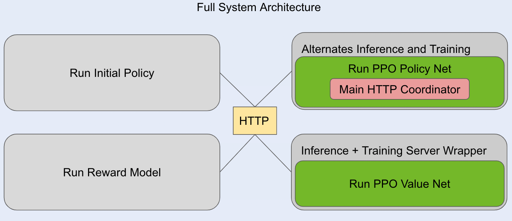
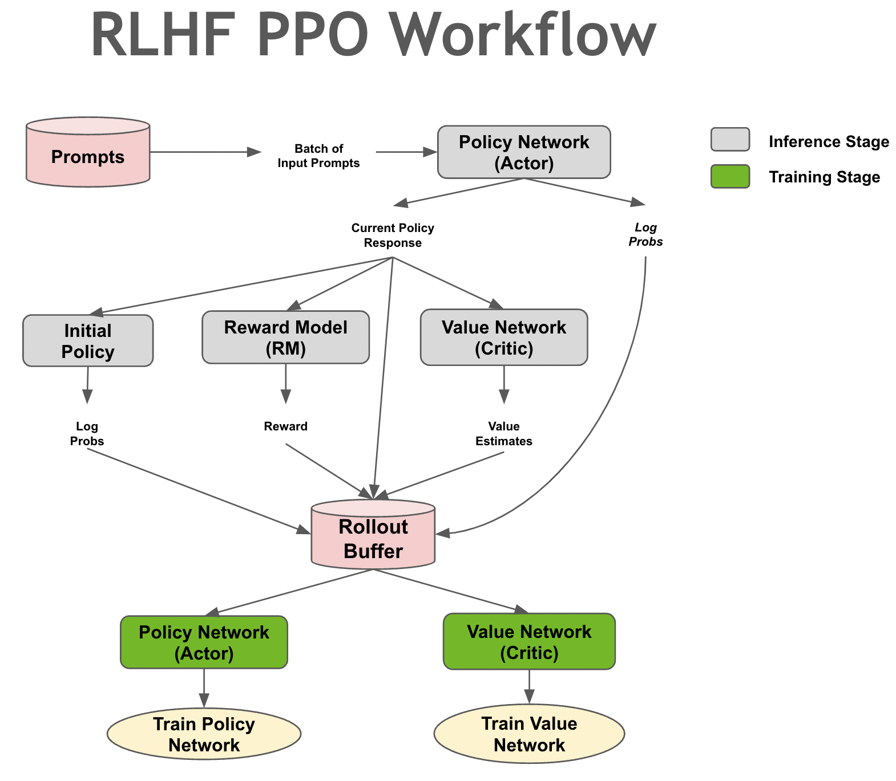

# RLHF Training architecture and details

## PPO training
During PPO training, four different models will be interacting with each other:

1. The PPO Actor Network (also known as the Policy Network): This is the model we are training, and it should start from an SFT model.
2. The Reward Model (RM) Network (also known as a Preference Model (PM)): This model takes a prompt concatenated with a response as input, and outputs a single scalar value: the reward, which the PPO algorithm will try to maximize.
3. The PPO Critic Network (also known as the Value Network): Since PPO is an Actor-Critic algorithm, we need a Critic to guide the Actor during training. The Critic will provide value estimates for each token in the responses provided by the Actor. These values can be seen as an estimate of the total reward the Actor will receive after generating all the remaining tokens. The Critic should be initialized from the RM so as to provide useful feedback in the early stages of training. Note: The RM generates a single reward for the entire sequence, whereas the Critic generates a value for each token.
4. The Initial Policy Network (also known as the Reference Model): We use this model to compute a KL Divergence penalty term that ensures that the PPO Actor does not diverge too much from the Initial Policy. This way, we prevent the PPO Actor from overfitting to the rewards given by the RM, and ensure it does not forget the knowledge it acquired during pretraining and SFT. This model should be the one used to initialize the PPO Actor Network.

### PPO Architecture
NeMo-Aligner takes a fully distributed approach to RL training. It hosts the components of the RL model using a PyTriton server and then gets the PPO actor to coordinate between the different servers. Here is a conceptual illustration of our system:

### PPO Process Diagram
The actor will coordinate with each component using a Pytriton client. The workflow of our codebase can be demonstrated in this illustration:

**NOTE**: For efficiency reasons we default to running the initial policy in the same job as the actor, and the reward model in the same job as the critic by utilizing CPU weight offloading. This reduces the communication overhead and node count.

### PPO Hyperparameters
There are a lot of hyperparameters in the PPO algorithm, which can be quite unstable and require a lot of tuning. We release configurations that are our best settings so far and list below the important ones with brief explanations of their role.

#### Hyperparameters in the PPO Actor
All the model parameters can be controlled the same way as in other NeMo training jobs. However, we also provide full control of the behavior of PPO during training. These are the available hyper-parameters:
* `trainer.ppo.initial_policy_kl_penalty`: Weight of the KL Divergence w.r.t. the Initial Policy in the PPO loss.
* `trainer.ppo.use_absolute_kl`: Whether or not to use the absolute value of the KL Divergence w.r.t. the Initial Policy.
* `trainer.ppo.discount_factor`: Discount factor for calculating the returns and advantages.
* `trainer.ppo.gae_lambda`: Lambda value for the Generalized Advantage Estimation (GAE) calculation.
* `trainer.ppo.normalize_advantages`: Whether or not to normalize the advantages to have a mean of zero and standard deviation of one within each global batch.
* `model.ppo.entropy_bonus`: Weight of the entropy term in the PPO loss.
* `model.ppo.ratio_eps`: Epsilon value for clipping the PPO ratio during training.
* `remote_critic_rm.{reward_model,critic}.{ip,port}`: Provide the ip address and the port where the Reward Model and/or PPO Critic will be running, to enable communication with them.
* `model.ppo.num_rollout_samples`: Number of samples that will be generated during the rollout stage before moving to the training stage.

**Note**: although the sampling parameters during the rollout phase can also be modified (through `model.ppo.sampling_params.*`), it is not recommended to do so because the implementation currently does not account for these changes when computing the log probabilities of the generated responses.

#### Hyperparameters in the PPO Critic
* `model.loss_clip_val`: Used in the Critic loss term that clamps the difference between the current Critic value predictions and those that were predicted during rollout generation (disabled when set to zero).

### Performance Hyperparameters
We have many optimizations available for performance that you can enable.

#### Actor performance optimization hyperparameters
* **`model.ppo.rollout_micro_batch_size`**: This sets the micro batch size for generation, generation is the most expensive step in RL, so try to set this to a number as high as possible.
* `model.ppo.offload_adam_states`: When enabled, we offload the distributed adam optimizer states onto CPU before doing actor generation. We only load the optimizer states back during training. This gives more memory for a bigger rollout micro batch size during generation. No effect if the optimizer is not distributed adam.
* `model.ppo.length_params.max_length`: This sets the max tokens to generate in rollouts, it defaults to half the sequence length of the model. But if you know your model is not too verbose (e.g. after supervised fine tuning) then you can set it to a lower number.

#### Critic performance optimization hyperparameters
* `trainer.ppo.combine_rm_and_critic_server`: When enabled, inference requests to the critic server will also return the rewards. This saves the need of having to run a seperate reward model server..
* `model.offload_adam_states`: When enabled, offload the distributed adam optimizer states onto CPU during inference. This allows us to save memory during inference for a bigger `trainer.ppo.inference_micro_batch_size`. No effect if the optimizer is not distributed adam.
