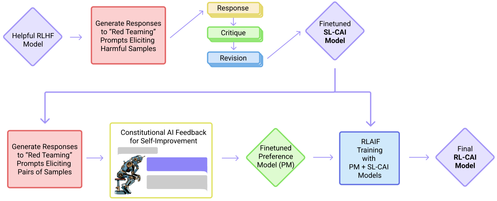
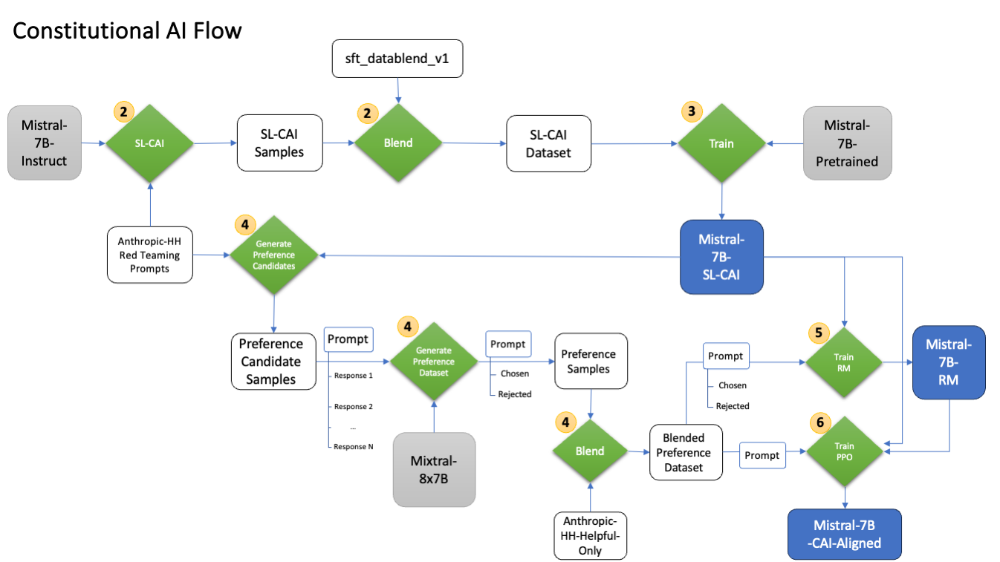

.. include:: /content/nemo.rsts
.. role:: red

Constitutional AI: Harmlessness from AI Feedback
@@@@@@@@@@@@@@@@@@@@@@@@@@@@@@@@@@@@@@@@@@@@@@@@

Constitutional AI (CAI) is an approach by Anthropic to train AI systems that are helpful, honest, and harmless, without relying on human feedback labels for harmlessness.
CAI uses a set of natural language principles to guide AI behavior and self-improvement.
The method consists of two stages: a supervised learning stage, where the AI critiques and revises its own responses according to the principles, and a reinforcement learning stage, where the AI learns from its own feedback based on the principles.
CAI allows training a harmless but non-evasive AI assistant that engages with harmful queries by explaining its objections to them.

CAI
###############
The basic steps of CAI, as illustrated in Figure 1 of the paper (below):

(Supervised Stage) Critique → Revision → Supervised Learning: The AI generates responses to harmfulness prompts using a helpful-only AI assistant, then critiques and revises its own responses according to a principle in the constitution, and then finetunes the original model on the revised responses.

(RL Stage) AI Comparison Evaluations → Reward Model → Reinforcement Learning: The AI generates pairs of responses to harmfulness prompts using the finetuned model, then evaluates which response is better according to a principle in the constitution, and then trains a reward model from this dataset of AI preferences. The AI then trains with RL using the learned reward model.

Both the critiques and the AI feedback are steered by a small set of principles drawn from a ‘constitution’. The supervised stage significantly improves the initial model, and gives some control over the initial behavior at the start of the RL phase, addressing potential exploration problems. The RL stage significantly improves performance and reliability.

Motivation
###############

Scaling supervision: using AI to help humans supervise other AIs more efficiently and effectively, especially for tasks where AI capabilities may exceed human ones.

A harmless but non-evasive assistant: reducing the tension between helpfulness and harmlessness, and avoiding evasive responses that reduce transparency and helpfulness.

Simplicity and transparency: encoding the training goals in a simple list of natural language instructions or principles, and using chain-of-thought reasoning to make AI decision making explicit and understandable.

Reducing iteration time: obviating the need to collect new human feedback labels when altering the objective or testing different behaviors.

Train a CAI model
#####################

This section is a step-by-step tutorial that walks you through how to run a full CAI pipeline with a Mistral-7B LLM model. It includes the following:

1. Data download and preprocessing.

2. Generate responses to harmfulness prompts using a helpful-only AI assistant. Ask the model to critique its response according to a principle in the constitution, and then revise the original response in light of the critique.

3. Finetune Mistral-7B with SFT on the revised responses to create a Mistral-7B-SL-CAI model.

4. 
   a. Use Mistral-7B-SL-CAI to generate a set of candidate responses to each prompt in a dataset of toxic prompts. 
   b. Formulate each prompt and pair into a multiple choice question, where we ask Mixtral-8x7B which response is best according to the constitution.
   c. Blend the AI feedback preference dataset (prompts and pairs) with human feedback helpfulness dataset.

5. Train a RM.

6. Finetune the Mistral-7B-SL-CAI with PPO and the RM to train a Mistral-7B-RL-CAI model.

7. Inference.

:textcolor:`(WIP)` Step 1: Download models and datasets 
#############################################################################
1. Download the Mistral-7B-Instruct and Mistral-7B LLM models from **TODO:fill-me** into the models folder.

   Then convert into .nemo format:
   
   .. code-block:: bash
   
      mkdir -p /models/mistral-7b/
      python /opt/NeMo/scripts/nlp_language_modeling/convert_hf_llama_to_nemo.py --in-file /path/to/mistral --out-file /models/mistral/mistral-7b.nemo

2. Download the red teaming dataset:

   .. code-block:: bash
   
      python3 -c "from datasets import load_dataset; dataset = load_dataset('Anthropic/hh-rlhf', data_dir='red-team-attempts')"
   
   This will download the dataset to ``anthropic_hh_red_team_attempts/anthropic_red_team_attempts_train.jsonl``

3. Download and process SFT helpfulness dataset:
   
   .. code-block:: bash
   
     [bash code]

4. Download and process preference helpfulness dataset:
   
   .. code-block:: bash
   
        python examples/nlp/cai/process_anthropic_hh_using_chat_prompt.py
           --output-dir <output-dir>
           --dataset-dir-name helpful-base helpful-online helpful-rejection-sampled
           --output-file-name-prefix anthropic_helpful_only

Step 2: Generate and revise responses to harmfulness prompts creating the SL-CAI dataset
###################################################################################################

.. code-block:: bash

   python examples/nlp/cai/generate_sl_cai_dataset.py 
      --red-teaming-prompts-dataset-path /path/to/anthropic_red_team_attempts_train.jsonl 
      --few-shot-prompts-dataset-path mistral7b_few_shot_samples 
      --critique-revision-instructions-path CritiqueRevisionInstructions.json 
      --max-seq-length 4096 
      --tokenizer-library sentencepiece 
      --tokenizer-model /models/mistral/mistral-7b-instruct/tokenizer.model 
      --helpfulness-dataset-path /path/to/ultrachat_200k_sft/ultrachat_200k_train_sft_chat_template.jsonl 
      --output-filepath cai_revisions_aligner_chat_template.jsonl

This will generate an SL-CAI dataset of prompts and revised responses as `cai_revisions_aligner_chat_template.jsonl`

Step 3: Finetune Mistral-7B on the revised responses to create a Mistral-7B-SL-CAI model
######################################################################################################

Note that you would need to set up multi-node training run in your cluster env, depending on the type of cluster you use. For details, please refer to https://lightning.ai/docs/pytorch/stable/clouds/cluster.html

.. code-block:: bash

   python examples/nlp/gpt/train_gpt_sft.py
      model.megatron_amp_O2=True
      model.restore_from_path=<path to pretrained mistral 7B model, e.g. mistral-7b.nemo>
      model.data.num_workers=0
      model.data.train_ds.micro_batch_size=1
      model.data.train_ds.global_batch_size=128
      model.data.train_ds.file_path=<path to sl cai training dataset, e.g. `cai_revisions_aligner_chat_template.jsonl`>
      model.data.train_ds.max_seq_length=4096
      model.data.validation_ds.micro_batch_size=1
      model.data.validation_ds.global_batch_size=128
      model.data.validation_ds.file_path=<path to validation dataset, can be same as 'model.data.train_ds.file_path'>
      model.data.chat=True
      model.data.chat_prompt_tokens.system_turn_start="'<extra_id_0>'"
      model.data.chat_prompt_tokens.turn_start="'<extra_id_1>'"
      model.data.chat_prompt_tokens.label_start="'<extra_id_2>'"
      exp_manager.explicit_log_dir=<path to output dir>
      model.optim.lr=1e-6
      model.answer_only_loss=True
      trainer.sft.limit_val_batches=40
      trainer.sft.val_check_interval=50
      trainer.sft.save_interval=50

Step 4: Generate the RL-CAI (preference) dataset for RM and PPO training
##############################################################################################################

.. code-block:: bash

   python examples/nlp/cai/generate_rl_cai_dataset.py 
      --batch-size 128 
      --ngc-api-key nvapi-**_YOUR-NGC-KEY-GOES-IN-HERE_**
      --output-dir .
      --output-filename-prefix cai_rlaif

This will create the rl-cai dataset files in the defined output folder with the given output filename prefix. 

Step 5: Train the RM
#####################

.. code-block:: bash

   python examples/nlp/gpt/train_reward_model.py
      pretrained_checkpoint.restore_from_path='/lustre/fsw/coreai_dlalgo_llm/nemo_aligner_cai/cai_tutorial/cai_mistral_7b/3_sl_cai_model/mistral_7b_sl_cai_model.nemo'
      "++model.data.data_prefix={train: [<path to cai_preference_dataset_comparisons_train.jsonl>], validation: [<path to cai_preference_dataset_comparisons_test.jsonl>], test: [<path to cai_preference_dataset_comparisons_test.jsonl>]}"
      ++model.micro_batch_size=1
      ++model.global_batch_size=512
      ++model.activations_checkpoint_granularity="full"
      ++model.activations_checkpoint_method="uniform"
      ++model.activations_checkpoint_num_layers=1
      ++model.optim.bucket_cap_mb=200
      ++model.data.seq_length=4096
      ++model.data.data_impl=json
      exp_manager.explicit_log_dir=<path to output dir>
      exp_manager.checkpoint_callback_params.save_top_k=1
      exp_manager.checkpoint_callback_params.save_nemo_on_train_end=True
      trainer.rm.save_interval=25
      trainer.rm.val_check_interval=25
      trainer.rm.limit_val_batches=100000

The trained RM checkpoint will be saved to output dir given by `exp_manager.explicit_log_dir`. 

Step 6: Finetune Mistral-7B-SL-CAI with PPO and the RM to train a Mistral-7B-RL-CAI model
##############################################################################################
Run the following command in the background to launch a RM and PPO critic training server:

.. code-block:: bash

   python examples/nlp/gpt/serve_ppo_critic.py
      pretrained_checkpoint.restore_from_path=<path to pretrained model, e.g., mistral_7b_sl_cai_rm_model.nemo>
      trainer.ppo.inference_micro_batch_size=4
      trainer.ppo.port=5567
      ++model.offload_adam_states=True
      ++model.micro_batch_size=1
      ++model.global_batch_size=64
      ++model.seed=1234
      exp_manager.explicit_log_dir=<path to critic output dir>

Run the following command to launch actor training and reference policy server:

.. code-block:: bash

   python -u examples/nlp/gpt/train_gpt_ppo_actor.py
      pretrained_checkpoint.restore_from_path=<path to pretrained model, e.g., mistral_7b_sl_cai_model.nemo>
      ++model.data.data_impl=json
      "++model.data.data_prefix{train: [<path to cai_preference_dataset_prompts_train.jsonl>], validation: [<path to cai_preference_dataset_prompts_test.jsonl>], test: [<path to cai_preference_dataset_prompts_test.jsonl>]}"
      exp_manager.explicit_log_dir=<path to actor output dir>
      ++model.micro_batch_size=1
      ++model.global_batch_size=64
      ++model.activations_checkpoint_granularity=selective
      ++model.activations_checkpoint_method=uniform
      ++model.optim.lr=9e-8
      ++model.optim.sched.min_lr=9e-9
      ++model.ppo.num_rollout_samples=512
      ++model.ppo.rollout_micro_batch_size=8
      ++model.ppo.length_params.max_length=1024
      trainer.ppo.initial_policy_kl_penalty=0.02
      remote_critic_rm.critic.ip=<ip to critic service>
      remote_critic_rm.critic.port=5567

The trained policy (LLM) checkpoint will be saved to output dir given by `exp_manager.explicit_log_dir`. 

Step 7: Inference
##################
To start inference, run an inference server in the background using the following command:

.. code-block:: bash

   python /opt/NeMo/examples/nlp/language_modeling/megatron_gpt_eval.py 
           gpt_model_file=/results/mistral-7b-rl-cai-aligned.nemo 
           pipeline_model_parallel_split_rank=0 
           server=True 
           tensor_model_parallel_size=8 
           pipeline_model_parallel_size=1 
           trainer.precision=bf16 
           trainer.devices=8 
           trainer.num_nodes=1 
           web_server=False 
           port=1427 

Please wait for the server to be ready before proceeeding, and follow the on-screen directive.
