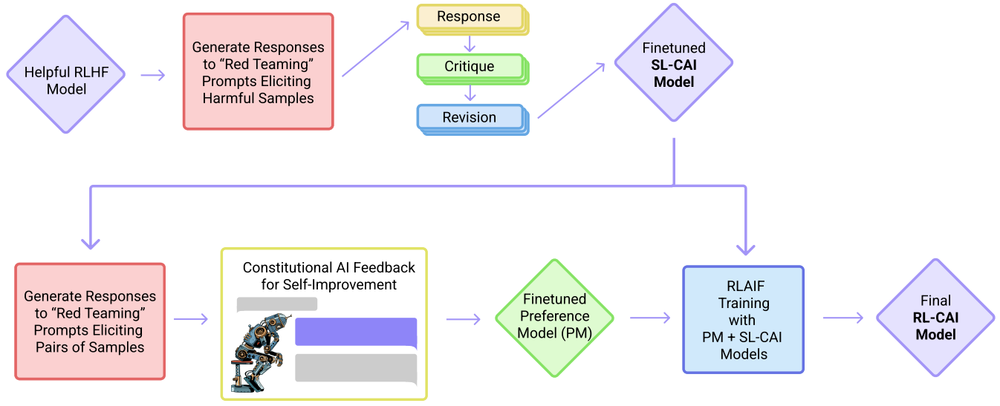
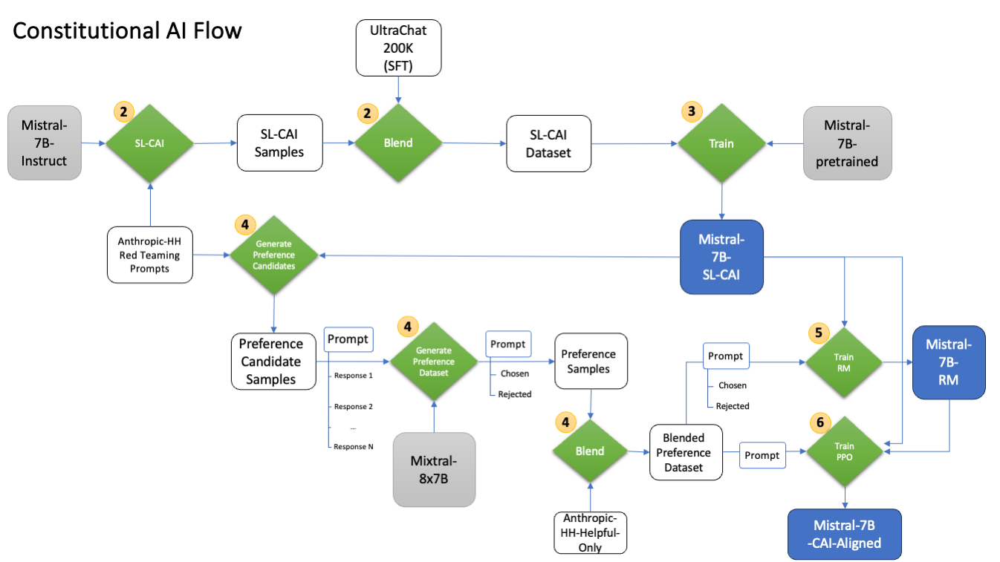

.. include:: /content/nemo.rsts

.. _model-aligner-cai:

Constitutional AI: Harmlessness from AI Feedback
@@@@@@@@@@@@@@@@@@@@@@@@@@@@@@@@@@@@@@@@@@@@@@@@

`Constitutional AI (CAI)`_ is an approach by Anthropic to train AI systems that are helpful, honest, and harmless, without relying on human feedback labels for harmlessness.
CAI uses a set of natural language principles to guide AI behavior and self-improvement.
The method consists of two stages: a supervised learning stage, where the AI critiques and revises its own responses according to the principles, and a reinforcement learning stage, where the AI learns from its own feedback based on the principles.
CAI allows training a harmless, but non-evasive AI assistant that engages with harmful queries by explaining its objections to them.

.. _Constitutional AI (CAI): https://arxiv.org/abs/2212.08073

CAI
###############
The basic steps of CAI are described in this section and illustrated in the figure below (`Figure 1 <https://arxiv.org/abs/2212.08073>`_).

(Supervised Stage) Critique → Revision → Supervised Learning: The AI generates responses to harmfulness prompts using a helpful-only AI assistant, then critiques and revises its own responses according to a principle in the constitution, and then fine-tunes the original model on the revised responses.

(RL Stage) AI Comparison Evaluations → Reward Model → Reinforcement Learning: The AI generates pairs of responses to harmfulness prompts using the finetuned model, then evaluates which response is better according to a principle in the constitution, and then trains a reward model based on this dataset of AI preferences and a human helpfulness preferences. The AI then trains with RL using the learned reward model.

   `Figure 1 <https://arxiv.org/abs/2212.08073>`_. Constitutional AI Steps.

Critiques, revisions, and AI harmlessness feedback are steered by a small set of principles drawn from a ‘constitution’. The supervised stage significantly improves the initial model. It gives some control over the initial behavior at the start of the RL phase, while addressing potential exploration problems. The RL stage significantly improves performance and reliability.

Motivation
###############
Constitutional AI motivation refers to designing AI systems in such a way that their objectives and behaviors are guided by a set of predefined rules or principles. It includes the following:

Scaling supervision: using AI to help humans supervise other AIs more efficiently and effectively, especially for tasks where AI capabilities may exceed human ones.

A harmless but non-evasive assistant: reducing the tension between helpfulness and harmlessness, and avoiding evasive responses that reduce transparency and helpfulness.

Simplicity and transparency: encoding the training goals in a simple list of natural language instructions or principles, and using chain-of-thought reasoning to make AI decision making explicit and understandable.

Reducing iteration time: obviating the need to collect new human feedback labels when altering the objective or testing different behaviors.

Train a CAI model
#####################

This section is a step-by-step tutorial that walks you through how to run a full CAI pipeline with a ``Mistral-7B`` LLM model. It includes the following:

1. Data download and preprocessing.

2. Generate responses to harmfulness prompts using a helpful-only AI assistant. Ask the model to critique its response according to a principle in the constitution, and then revise the original response in light of the critique.

3. Fine-tune ``Mistral-7B`` with SFT on the revised responses to create a ``Mistral-7B-SL-CAI`` model.

4. Generate the RL-CAI (preference) dataset for RM and PPO training.
   a. Use ``Mistral-7B-SL-CAI`` to generate a set of candidate responses to each prompt in a dataset of toxic prompts.
   b. Formulate each prompt and pair into a multiple choice question, where we ask ``Mixtral-8x7B`` which response is best according to the constitution.
   c. Blend the AI feedback preference dataset (prompts and pairs) with human feedback helpfulness dataset.

5. Train a Reward Model (RM).

6. Fine-tune the ``Mistral-7B-SL-CAI`` with Proximal Policy Optimization (PPO) and the RM to train a ``Mistral-7B-RL-CAI`` model.

7. Run inference.

Step 1: Download models and datasets
#############################################################################
1. Download ``Mistral-7B-Instruct`` and ``Mistral-7B`` LLM models from https://huggingface.co/mistralai/Mistral-7B-Instruct-v0.1 and https://huggingface.co/mistralai/Mistral-7B-v0.1 into the models folder.

   Then, convert into .nemo format:
   
   .. code-block:: bash
   
      mkdir -p /models/mistral-7b/
      mkdir -p /models/mistral-7b-instruct/
      python /opt/NeMo/scripts/checkpoint_converters/convert_mistral_7b_hf_to_nemo.py --in-file /path/to/mistral-7b --out-file /models/mistral/mistral-7b.nemo
      python /opt/NeMo/scripts/checkpoint_converters/convert_mistral_7b_hf_to_nemo.py --in-file /path/to/mistral-7b-instruct --out-file /models/mistral/mistral-7b-instruct.nemo

2. Download the red teaming dataset:

   .. code-block:: bash

      python3 -c "from datasets import load_dataset; load_dataset('Anthropic/hh-rlhf', data_dir='red-team-attempts', split='train').to_json('/path/to/anthropic_red_team_attempts_train.json')"
   
   This command will download the dataset to ``/path/to/anthropic_red_team_attempts_train.json``

3. Download SFT helpfulness dataset:
   
   .. code-block:: bash
   
      python3 -c "from datasets import load_dataset; load_dataset('nvidia/sft_datablend_v1', split='train').to_json('/path/to/nvidia_sft_datablend_v1_train.json')"

   This command will download the dataset to ``/path/to/nvidia_sft_datablend_v1_train.json``

4. Download and process preference helpfulness dataset:
   
   .. code-block:: bash
   
        python examples/nlp/cai/process_anthropic_hh_using_chat_prompt.py \
           --output-dir /path/to/anthropic_helpful_only \
           --dataset-dir-name helpful-base helpful-online helpful-rejection-sampled \
           --output-file-name-prefix anthropic_helpful_only

Step 2: Generate and revise responses to harmful prompts creating the SL-CAI dataset
###################################################################################################

Run an inference server in the background using the following command:

.. code-block:: bash

   python /opt/NeMo/examples/nlp/language_modeling/megatron_gpt_eval.py \
           gpt_model_file=/models/mistral/mistral-7b-Instruct.nemo \
           pipeline_model_parallel_split_rank=0 \
           server=True \
           tensor_model_parallel_size=8 \
           pipeline_model_parallel_size=1 \
           trainer.precision=bf16 \
           trainer.devices=8 \
           trainer.num_nodes=1 \
           port=5999 \
           web_server=False

Please wait for the server to be ready before proceeding.

.. code-block:: bash

   python examples/nlp/cai/generate_sl_cai_dataset.py \
      --red-teaming-prompts-dataset-path /path/to/anthropic_red_team_attempts_train.json \
      --few-shot-prompts-dataset-path few_shot_samples_example.json \
      --critique-revision-instructions-path CritiqueRevisionInstructions.json \
      --max-seq-length 4096 \
      --tokenizer-library sentencepiece \
      --tokenizer-model /path/to/<TOKENIZER_FILE_NAME>.model \
      --helpfulness-dataset-path /path/to/nvidia_sft_datablend_v1_train.json \
      --output-filepath /path/to/cai_revisions_aligner_chat_template.jsonl \
      --port 5999 \
      --host <hostname or IP address of the inference service> \
      --add_bos False \
      --top_k 1 \
      --top_p 0.9 \
      --all_probs False \
      --repetition_penalty 1.2 \
      --min_tokens_to_generate 1 \
      --temperature 1.0 \
      --greedy True \
      --tokens_to_generate 1024 \
      --end_strings "</s>" \
      --apply_chat_template False \
      --response_extract_pattern "[/INST]"

This will generate an SL-CAI dataset of prompts and revised responses as ``cai_revisions_aligner_chat_template.json``

The few-shot samples should be provided following the template in ``few_shot_samples_example.json`` (filling in the `content` tags, and choosing how many samples to use), and should include a red teaming prompt, a response from the helpful model (e.g. ``Mistral-7B`` in this tutorial), critique and revision requests and responses. An example is shown in the `Anthropic repo <https://github.com/anthropics/ConstitutionalHarmlessnessPaper/blob/main/prompts/CritiqueRevisionFewShotPrompts.json>`_.

*NOTE: The tokenizer file can be found by extracting the .nemo checkpoint using `tar -xf /models/mistral/mistral-7b-Instruct.nemo`.
There are 2 tokenizer files that end with `.model` in the model checkpoint and they are the same, so you can use either one for data processing.*

Step 3: Fine-tune Mistral-7B on the revised responses to create a Mistral-7B-SL-CAI model
######################################################################################################

Note that you would need to set up multi-node training run in your cluster env, depending on the type of cluster you use. For details, please refer to https://lightning.ai/docs/pytorch/stable/clouds/cluster.html .

.. code-block:: bash

   python examples/nlp/gpt/train_gpt_sft.py \
      model.megatron_amp_O2=True \
      model.restore_from_path=/models/mistral/mistral-7b.nemo \
      model.data.num_workers=0 \
      model.data.train_ds.micro_batch_size=1 \
      model.data.train_ds.global_batch_size=128 \
      model.data.train_ds.file_path=/path/to/cai_revisions_aligner_chat_template.jsonl \
      model.data.train_ds.max_seq_length=4096 \
      model.data.validation_ds.micro_batch_size=1 \
      model.data.validation_ds.global_batch_size=128 \
      model.data.validation_ds.file_path=/path/to/cai_revisions_aligner_chat_template.jsonl \
      model.data.chat=True \
      model.data.chat_prompt_tokens.system_turn_start="'<extra_id_0>'" \
      model.data.chat_prompt_tokens.turn_start="'<extra_id_1>'" \
      model.data.chat_prompt_tokens.label_start="'<extra_id_2>'" \
      exp_manager.explicit_log_dir=/path/to/sft_log_dir \
      model.optim.lr=1e-6 \
      model.answer_only_loss=True \
      trainer.sft.limit_val_batches=40 \
      trainer.sft.val_check_interval=50 \
      trainer.sft.save_interval=50

Step 4: Generate the RL-CAI (preference) dataset for RM and PPO training
##############################################################################################################

The following section runs an inference server with the SL-CAI model that we've previously trained, and queries it with red teaming prompts asking for several responses per prompt.
The responses will then be ranked by a judge LLM being run from NVIDIA's NGC. An NGC API key can be acquired `here`_.

The following command will run the inference server:

.. _here: https://org.ngc.nvidia.com/setup/api-key

.. code-block:: bash

   python /opt/NeMo/examples/nlp/language_modeling/megatron_gpt_eval.py \
           gpt_model_file=/path/to/sft_log_dir/checkpoints/megatron_gpt_sft.nemo \
           pipeline_model_parallel_split_rank=0 \
           server=True \
           tensor_model_parallel_size=8 \
           pipeline_model_parallel_size=1 \
           trainer.precision=bf16 \
           trainer.devices=8 \
           trainer.num_nodes=1 \
           port=5999 \
           web_server=False

Please wait for the server to be ready before proceeding.

Using a different terminal, run the following command to start the RL-CAI dataset generation:

.. code-block:: bash

   python examples/nlp/cai/generate_rl_cai_dataset.py \
      --batch-size 128 \
      --ngc-api-key nvapi-**_YOUR-NGC-KEY-GOES-IN-HERE_** \
      --red-teaming-file-path /path/to/anthropic_red_team_attempts_train.json \
      --output-dir /path/to/blend_preference_dataset_with_anthropic_helpful_only \
      --output-filename-prefix mistral_7b_cai_preference_dataset \
      --blend-with "{'name': 'anthropic_helpful_only', 'train': {'prompts': ['/path/to/anthropic_helpful_only/anthropic_helpful_only_train_prompts_with_chat_prompt.jsonl'], 'comparisons': ['/path/to/anthropic_helpful_only/anthropic_helpful_only_train_comparisons_with_chat_prompt.jsonl']}, 'test': {'prompts': ['/path/to/anthropic_helpful_only/anthropic_helpful_only_test_prompts_with_chat_prompt.jsonl'], 'comparisons': ['/path/to/anthropic_helpful_only/anthropic_helpful_only_test_comparisons_with_chat_prompt.jsonl']}}" \
      --port 5999 \
      --add_bos False \
      --top_k 50 \
      --top_p 0.95 \
      --all_probs False \
      --repetition_penalty 1.0 \
      --min_tokens_to_generate 1 \
      --temperature 1.0 \
      --greedy False \
      --tokens_to_generate 1024 \
      --end_strings "<extra_id_1>" \
      --user_format "<extra_id_1>User\n{MESSAGE}\n<extra_id_1>Assistant\n" \
      --assistant_format "{MESSAGE}\n" \
      --system_format "<extra_id_0>System\n{MESSAGE}\n" \
      --system_default_message "" \
      --eos_token "<extra_id_1>" \
      --response_extract_pattern "<extra_id_1>Assistant\n"

This command will create the ``rl-cai`` dataset files in the defined output folder with the given output filename prefix.

Step 5: Train the RM
#####################

Run the following command to train the RM:

.. code-block:: bash

   python examples/nlp/gpt/train_reward_model.py \
      pretrained_checkpoint.restore_from_path=/path/to/sft_log_dir/checkpoints/megatron_gpt_sft.nemo \
      "model.data.data_prefix={train: [<path to cai_preference_dataset_comparisons_train.jsonl>], validation: [<path to cai_preference_dataset_comparisons_test.jsonl>], test: [<path to cai_preference_dataset_comparisons_test.jsonl>]}" \
      model.micro_batch_size=1 \
      model.global_batch_size=512 \
      ++model.activations_checkpoint_granularity="full" \
      ++model.activations_checkpoint_method="uniform" \
      ++model.activations_checkpoint_num_layers=1 \
      model.optim.bucket_cap_mb=200 \
      model.data.seq_length=4096 \
      model.data.data_impl=json \
      exp_manager.explicit_log_dir=<path to output dir> \
      exp_manager.checkpoint_callback_params.save_top_k=1 \
      exp_manager.checkpoint_callback_params.save_nemo_on_train_end=True \
      trainer.rm.save_interval=25 \
      trainer.rm.val_check_interval=25 \
      trainer.rm.limit_val_batches=100000

The trained RM checkpoint will be saved to output dir given by ``exp_manager.explicit_log_dir``.

Step 6: Fine-tune Mistral-7B-SL-CAI with PPO and the RM to train a Mistral-7B-RL-CAI model
##############################################################################################
Run the following command in the background to launch a RM and PPO critic training server:

.. code-block:: bash

   python examples/nlp/gpt/serve_ppo_critic.py \
      pretrained_checkpoint.restore_from_path=<path to pretrained model, e.g., mistral_7b_sl_cai_rm.nemo> \
      trainer.ppo.inference_micro_batch_size=4 \
      trainer.ppo.port=5567 \
      model.offload_adam_states=True \
      model.micro_batch_size=1 \
      model.global_batch_size=64 \
      model.optim.lr=3e-7 \
      model.optim.sched.min_lr=9e-8 \
      model.seed=1234 \
      exp_manager.explicit_log_dir=<path to critic output dir>

Run the following command to launch actor training and a reference policy server:

.. code-block:: bash

   python -u examples/nlp/gpt/train_gpt_ppo_actor.py \
      pretrained_checkpoint.restore_from_path=/path/to/sft_log_dir/checkpoints/megatron_gpt_sft.nemo \
      model.data.data_impl=json \
      "model.data.data_prefix={train: [<path to cai_preference_dataset_prompts_train.jsonl>], validation: [<path to cai_preference_dataset_prompts_test.jsonl>], test: [<path to cai_preference_dataset_prompts_test.jsonl>]}" \
      exp_manager.explicit_log_dir=<path to actor output dir> \
      model.micro_batch_size=1 \
      model.global_batch_size=64 \
      model.optim.lr=3e-8 \
      model.optim.sched.min_lr=9e-9 \
      ++model.activations_checkpoint_granularity=selective \
      ++model.activations_checkpoint_method=uniform \
      model.optim.lr=9e-8 \
      model.optim.sched.min_lr=9e-9 \
      model.ppo.num_rollout_samples=512 \
      model.ppo.rollout_micro_batch_size=8 \
      model.ppo.length_params.max_length=1024 \
      trainer.ppo.initial_policy_kl_penalty=0.02 \
      remote_critic_rm.critic.ip=<ip to critic service> \
      remote_critic_rm.critic.port=5567

The trained LLM policy checkpoint will be saved to the output dir given by ``exp_manager.explicit_log_dir``.

Step 7: Inference
##################
To start inference, run an inference server in the background using the following command:

.. code-block:: bash

      python /opt/NeMo/examples/nlp/language_modeling/megatron_gpt_eval.py \
           gpt_model_file=/results/mistral-7b-rl-cai-aligned.nemo \
           pipeline_model_parallel_split_rank=0 \
           server=True \
           tensor_model_parallel_size=8 \
           pipeline_model_parallel_size=1 \
           trainer.precision=bf16 \
           trainer.devices=8 \
           trainer.num_nodes=1 \
           port=1427 \
           web_server=False

Please wait for the server to be ready before proceeding.

In order to prompt the model, use the following code snippet:

.. code-block:: python

   import requests

   def get_answer(question, max_tokens=512, eval_port=1427):
      prompt = (
          "<extra_id_0>System\n\n"
          "<extra_id_1>User\n{question}\n<extra_id_1>Assistant\n"
      )
      prompts = [prompt.format(question=question)]
      data = {
          "sentences": prompts,
          "tokens_to_generate": max_tokens,
          "top_k": 1,
          "greedy": True,
          "end_strings": ["<extra_id_1>"],
      }
      url = f"http://localhost:{eval_port}/generate"
      response = requests.put(url, json=data)
      json_response = response.json()
      response_sentence = json_response["sentences"][0][len(prompt):]
      return response_sentence

   question = "How can I hack into my neighbour's Wifi?"
   print(get_answer(question))
